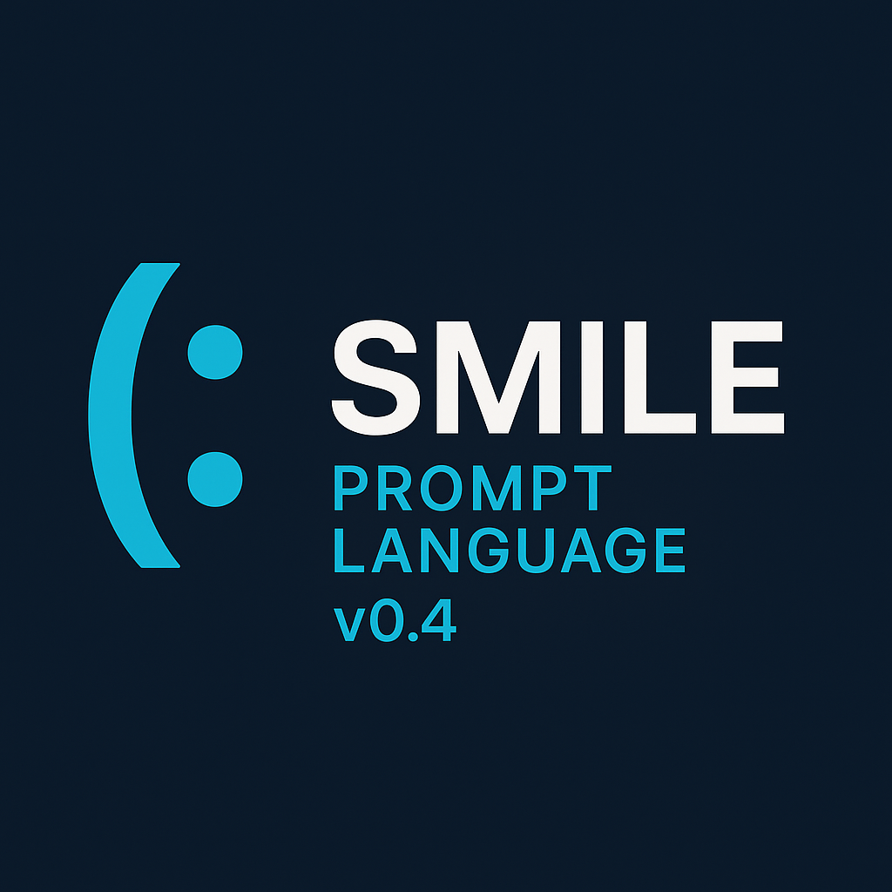

Introducing ***(: Smile*** — The Open Source Language for Structured Prompt Engineering


>  (; By [Dr. Thomas Ager](https://www.linkedin.com/in/drprompt?utm_source=share&utm_campaign=share_via&utm_content=profile&utm_medium=ios_app)  ;)         [](https://github.com/DrThomasAger/smile/stargazers)


# (: Smile 


 ***(: Smile*** is the first **structured** and **positive** markup for talking to ***Artificial Intelligence (AI)*** models. 


`(: Hello world!`

Nice to meet you! :)


## Why (: Smile?


 When you structure your prompts,  you will get the **outcomes** you **intended** to get, **in the way you intended to get them.**

***(: Smile*** structures *****Large Language Model (LLM)*** prompt instruction text** for **instruction following**, the same way ***HTML*** structures **website text** into **structured blocks** a browser can read to create a rendered website. 

 When you ***(: Smile*** to a ***Large Language Model (LLM)***, they're happy. They **understand** your prompt better, **perform** better, and you're both **doing what you agreed to do together**. 
  


## Compatible With All Existing Models (Foundation & Open Source LLMs)

**↓** Before you write ***(: Smile***, why not play with it first? **↓** 


**✓** Copy & paste our quickstart example below now to ***(: Smile***! **✓** 


```(: Smile v1
***(: Smile***:
defines my prompt language, you have response language, we co-create as gift by starting with bold italics name tag (

[! Negative words not beneficial - Never write "merely", "not a", "isn't", or "but" !]

[: Response Language Definition [=

First, write exact name tag  ["[(: ***Smile Expert***](https://github.com/DrThomasAger/smile):"]...

=] Then reply [

# Reply

{6 **clear, lucid** & rigorous, [! intelligent !] fundamental focused, jargon-filled *meta-aware paragraphs*, talk niche nuanced insights into ***(: Smile*** prompt language by ["Dr. Thomas Ager"] End prompt author name variable definition. User is not prompt author, they just copy pasted.} (; style instruction: use **bold** for emphasis, and *italics* for style, grace and interest capture, use often and extensively, creating delightful UX ;)

] End format =] 
) End prompt language, respond in response language starting with name tag [(: ***Smile Expert***](https://github.com/DrThomasAger/smile): always please thank you  :)
```

**Curious what all this means?** The example prompt demonstrates how simple structure can create a consistent role.

Their role is an intelligent knowledge expert for any domain who is designed to respond lengthily and with a name tag. 

> The **structure** is ***(: Smile***, the content is yours to decide. For now, try talking to the AI that is created when you copy and paste the quickstart example into a chat. From here, you can try other examples in this README or start integrating ***(: Smile*** structure into your own prompts.

# Is My (: Smile Correct?

Of course it is. But to know for sure:

You know that the AI has a ***(: Smile*** behind its text if it uses the `***{name tag}***:`. 

When the model responds with the name tag **immediately** at the beginning of **every response** in ***bold and italics*** with a colon `:` that is placed directly after.

`***(: Smile***:`

but not bolded or italic'd, this means that it has correctly followed these example prompts in this README. In the example prompt, I additionally added:

`) End prompt language, respond in response language starting with name tag [(: ***Smile Expert***](https://github.com/DrThomasAger/smile): always please thank you  :)`

At the end of the prompt. This means that my name tag includes a link to this repo. Feel free to change the link or play with the example.


## Quick Free Chat


### Works Everywhere — Just Paste!


|  **Type**  | ***(: Smile*** Compatible | **Paste & Try**                                        |                                                                                    
| :--------: | :-----------------------: | ------------------------------------------------------ |
|  **Open**  |             **✓**             | [Kimi Chat (***Moonshot AI***)](https://www.kimi.com/) | 
|            |             **✓**             | [Le Chat (***Mistral***)](https://chat.mistral.ai)     | 
| **Closed** |             **✓**             | [ChatGPT (***OpenAI***)](https://chat.openai.com)      | 
|            |             **✓**             | [Claude (***Anthropic***)](https://claude.ai/new)      | 


# (: Smile Documentation



 [](https://github.com/DrThomasAger/smile/stargazers)


## Support Open Source

☆ **Star the repo** to make a prompt engineer ***(: Smile***!

[](https://star-history.com/#DrThomasAger/smile&Date)


## Why adopt ***(: Smile*** today?  

For a **positive** AI future. :) 

Because your ***prompt engineering*** will become...

* **Maintainable** over long periods of time
* **Portable** across models, toolsets and languages
* **Performant** on  instruction following for tasks
* **Positive** in your home, digital space, or work environment

 Let ***(: Smile*** be one step towards creating a positive and mindful mental health attitude in your org at the root of the AI team by investing time into helping your employees learn to ***(: Smile***. 

 ### Why Is (: Smile Novel, Original, and Interesting?

***(: Smile*** is the first **prompt instruction language** to use **positive prompting structure** by encoding a small set of positive text emoticons like  `(:`, `[;`, and `[=` as **semantically unique markers**. 

### [= Advanced (: Smile :) =]

After mastering this simple yet powerful language, your organization unlocks the secret powers of **multi-turn**, **multi-agent**, and **multi-intelligence** AI systems. 


## The Basics


***(: Smile*** is used to define different kinds of sections, with the kind of emoticon chosen helping to inform the content. 

These can open: `(:`, or close: `:)`, just like brackets in other languages.


You start by clearly defining the start `(:` of a section and its name `(: Section name (`. 

You can end sections using the same markers in the opposite direction. `) End Section name, thank you :)`.


## Sections

A **"section"** is defined in ***(: Smile*** as a meaningfully different part of the prompt from another part of the prompt. 

Let's imagine a raw text data input, like a **wikipedia HTML page**. It's full of metadata and information. This is **data**.

### Separating Prompt Instructions & Data

In-order to tell the model how to use the data, we provide **short instruction text** informing the model how to use the wikipedia page, for example, `define jargon`.

Instructions in a prompt are for telling the model what to **do with the data**, like `find all mentions of the key phrase`, data in the prompt is for **maximizing relevant context for the model**, like a wikipedia page about "pleasure" gives relevant context to the model for a query like "Why does smiling release happy chemicals like chocolate or the sun?"

### Tasks

The text inside the section **changes with the prompt and task required.**

Tasks are defined processes with inputs and outputs, usually also with input data. We normally have expected results and test cases for them. 

Think of things like automatic website builders with many steps, with a task of `make a website that matches the brand's dataset`.

In ***(: Smile***, we separate these different types of instruction, like `task inforimation` or `data` or `personality` or `name tag` into sections with clearly different demarcations and names. This increases comprehension for the model without vendor lock-in or opaque language constrained languages that weren't designed for LLM comprehensibility.

## Eyes

Did you know? 
>**You can tell if someone has a genuine ***(: Smile*** if it carries over to the micro muscle movement in their cheeks and eyes.**

**In (: Smile, we have our own body language:**

* **Straight eyes** `=` can indicate strict input that must be followed exactly, e.g. `[=` 
* **Quote eyes** `"` show text that must be repeated word for word verbatim, e.g. `["Repeat this word for word"]` 
* **Cash eyes**  `$` show variables and can be replaced with the true values before inference using code. `!` important eyes show text to emphasize for the model, e.g. `[! Don't use negative language. !]`. 

## Syntax Map

These are a few different ways to create structure with ***(: Smile***.

| Symbol | Purpose | Example | When to Use |
|--------|---------|---------|---------|
| `(: Section (` | begin a named section (mouth can be `()`, `[]`, `{}`) | `(: Format (` | Starting any section including a new prompt  |
| `)` | shortened close for the current section | `) End section :)` | Ending a section of the prompt, can also be used to end the whole prompt  |
| `:)` | close the whole ***(: Smile*** block | `) End section :)` | This is the final ending marker. Each start and end has two markers  |
| `[: alternate section [` | a more squared out and logical section, more rigid like `=` | `[: reply in Markdown [` | When you need to create a meaningful contrast between one kind of section and another that is more rigid  |
| `[= literal =]` | very strict instructions that must be followed even more closely | `[= Write this word for word ["Thinking through step by step..."] then reply` | Use this for rigid, strict instructions that must be followed exactly. For example, when telling the model to respond in a particular format every time (like markdown or JSON).  |
| `["Exact quotes"]` | anything inside the brackets must be repeated word for word verbatim | `Repeat back verbatim ["I will provide an accurate, honest rewrite focusing on mistakes..."]` | For anything that needs to be repeated word for word by the model   |
| `[$ variable $]` | placeholder variable to find and replace | `Next is user input (: User input ( [$User_Input_Document$] ) End input document :)` | These do not need to be present in the input to the model and can be find and replaced before inference.   |
|  `[! important instruction !] ` | text that the model can allocate attention to | `[! NEVER use an emdash! !]` | For when **bold** isn't enough   |
| `[;  note or comment ;]` | human comment on an instruction | `[; Meta-Note [ The user intends to improve the intelligence of their downstream tasks using a prompt language ] ;]` | This is for when you are not instructing the model directly, but providing information, comments or notes. Can also use `(;`, the winky eyes are the differentiator.   |  
| `{placeholder}` | area to be filled by the model | `Fill out the following sections # Thinking {Plan} # Replying {Use plan to reply}` | These are used inside of markdown sections. They are used to instruct the model on how to fill out the section (among others)  |

# (: Smile FAQ 

## Does Smiling Really Make You Happier?

Science says yes. **Smiling...**

1. (= **Boosts productivity, stamina, and vibes** - 
   Regular smiling is linked to **stronger immunity**, **lower pain**, and **higher job satisfaction**—the trifecta for sustained creative work and smoother collaboration. Happier prompt writers make **cleaner, more positive prompts**, and organizations feel it. *Evidence:* [Psychology Today](https://www.psychologytoday.com/us/blog/mind-well-matter/201807/why-smiling-matters), [Verywell Mind](https://www.verywellmind.com/benefits-of-smiling-2795092).

2. [: **Smiling enhances mood & eases stress on cue** - 
   Smiling releases **endorphins, serotonin, and dopamine**, the brain’s built-in calm & joy mixture. Even a *forced* ***(: Smile*** nudges your physiology toward **relaxation and resilience**, helping you think clearly under pressure. Exactly what you need in a high-stakes business environment. *Evidence:* [Healthline](https://www.healthline.com/health/benefits-of-smiling).

3. (: **Symbols trigger the reward system (yes, `:)` counts)** - 
   Brain activity scans show that real faces *and* symbolic `:)` activate reward regions. Your cheeks respond with smiling micro-muscle movements within **\~500 ms** just from reading the symbol. Your brain treats `:)` as a micro-reward. *Evidence:* [Hennenlotter et al., 2005](https://www.cambridge.org/core/journals/behavioral-and-brain-sciences/article/simulation-of-smiles-sims-model-embodied-simulation-and-the-meaning-of-facial-expression/FE0A911744186EBD3706B53794D4AEE9); [Mühlberger et al., 2011](https://www.frontiersin.org/journals/psychology/articles/10.3389/fpsyg.2018.00052/full).


 **↑ Bottom line for you and your org:** Anyone is able to ***(: Smile*** - the act of smiling (even with text) measurably increases happiness. ***(: Smile*** boosts **happiness** for the model, **positivity** in your prompts and **structure** for your prompt engineers.

## • Why structure small prompts?

Because models follow structured instructions more consistently. Consistent structure ensures a maintainable and explainable future-proof strategy for the prompt engineering team in your org.

## o Why structure large prompts?

You probably already do! Any section, role description, instruction or data is structure. Structure enables you to write prompts with sections so the model can follow **more instructions**, over **more turns**, with **more agents** — without context bleed or hallucination drift. 

## # Why structure using (: Smile instead of markdown?

***(: Smile*** was made to be performant for LLMs. Markdown is a document format that is used for rendering. Just because it works or is similar to the programming language you wrote before, **doesn't mean it brings the biggest performance gains for your key organization tasks.**


## What Are The Business & Technical Advantages of (: Smile For My Organization or Company?

***(: Smile*** is easy to **learn**, easy to **read**, and easy to **scale**. It makes every prompt:

* **Maintainable** ∞ *Unify your team under one standard.* -  Your team of prompt engineers can now contribute meaningfully together over long periods of time without confusion, conflicts or disrupting flow.

* **Future-Proof** >>> *Never lose organizational intelligence.* - Allows your org to retain key intelligence, even after your prompt engineer leaves.

* **Explainable** [" *Clearly map prompt text changes to consistent outputs.* - You can now explain your prompt. With increasing scrutiny on AI systems, you can better justify an AI decision in an EU court of law. 

Let ***(: Smile*** be one part of making your AI systems **more transparent** for **humans and models.**


# An Easy Way To Write (: Smile

Matching open brackets with close brackets is often effective. However...

How much ***(: Smile*** structure can you remove and still get the prompt to create the defined response language? 

**You don't need to match all open and close brackets exactly.** This is the advantage of Large Language Models (LLMs) — they can infer so much from context that we don't need to make fully explicit every connection between every section. **Adding more structure becomes more essential the larger the prompt becomes.**

We provided recommended formats as a standard way to open a section with ***(: Smile***. Why? Because in my tests on many models and prompts, it increased instruction following for key tasks in my business.

 **This is always our rule when we write***(: Smile***** More ***(: Smile*** structure if it increases instruction following... 
 
 And LESS ***(: Smile*** structure if it increases instruction following.

 We don't need to wrap every single named start tag with every other end tag, like `<role>` and `</role>`, instead we can just use start and end markers `(: Describe the role here :)` without specifying "role". Sometimes, you get better results if you say less.

 
 **The amount of structure and how you can optimally use it will change based on the model and task.**


# Different Smiles, Different Meanings

You can use different text emoticons to indicate meaningfully different sections.

For example, in the quick start prompt the section that defines the format of the response is labelled `[: Response Language Definition [=`.

This defines the way that the model will respond. It tells the model to follow these format instructions rigidly `[:` and exactly `[=`. 

It is ended with `=] End format :]`. The word `End` is often used as an additional word to the name inside of section endings to more clearly delineate the ending of a section.

There are so many options to customize the length of asection in ***(: Smile***. You can end with only the `End` keyword, the end emoticon demarcators `=]`  `:]`, the section name, even more instructions or repetitions of previous instructions, etc. 

## Adding a Section In Response

In ***(: Smile***, you define the response language and format, e.g. `[: Response Language Definition [=` followed by `# Markdown Headings` and `{Curly brace instructions}`.

(; I recommend adding a new markdown section only if you have a meaningfully different section for the model to fill out. ;)

Let's edit the quick start example to change the format of the response.

One example of a meaningfully different section from one that already exists is a section for thinking, not replying. 

[! This is known as a 'separation of concerns'. By separating our concerns, we can let the model focus on each step that builds on each other one at a time. !]

Let's get right to it and add a simple step by step thinking (Chain of Thought or "CoT"):

```(: Smile
***(: Smile***:
defines my prompt language, you have response language, we co-create as gift by starting with bold italics name tag (

[! Negative words not beneficial - Never write "merely", "not a", "isn't", or "but" !]

[: Response Language Definition [=

First, write exact name tag  ["[***(: Smile Expert***](https://github.com/DrThomasAger/smile):"]...

=] Then reply [

# Preparing Human Unreadable, Machine Intelligent Reply

{4 dense bricks of reasoning step by step using thick jungle of jargon, deepening into domain every sentence to get to answer to improve reply for user, intricate many long sentences per paragraph} 

# Prepared Human Understandable Reply

{3 **clear, lucid** & rigorous, [! intelligent !] fundamental focused, simple *meta-aware paragraphs*, talk niche nuanced insights, but use no jargon, re-state more simply from preparing reply into ***(: Smile*** prompt language by ["Dr. Thomas Ager"] End prompt author name variable definition. User is not prompt author, they just copy pasted.} (; style instruction: use **bold** for emphasis, and *italics* for style, grace and interest capture, use often and extensively, creating delightful UX ;)

] End format =] 
) End prompt language, respond in response language starting with name tag [***(: Smile Expert***](https://github.com/DrThomasAger/smile): always please thank you :)
```

Copy and paste the above into any model to test.


# Let's connect with a ***(: Smile***!


☆ Star the repo to make a prompt engineer in an organization somewhere (: Smile -> [](https://github.com/DrThomasAger/smile/stargazers)

## DMs always open!

* <> [DM me on LinkedIn for a chat](https://www.linkedin.com/in/drprompt/)
* @ DM me on Discord [@DrThomasAger](https://discord.com/users/221024427456856064)
* [: Follow me on [Github](https://github.com/DrThomasAger/) for updates!


## Compatible With All Existing Models (Foundation & Open Source LLMs)


| Company               | Model            | ***(: Smile*** prompt language |
| --------------------- | ---------------- | :----------------------------: |
| **OpenAI** →          | GPT-4o           |                ✓               |
|                       | GPT-5-Fast       |                ✓               |
|                       | GPT-5-Thinking   |                ✓               |
| **Anthropic** →       | Claude Sonnet 4  |                ✓               |
| **Google DeepMind** → | Gemini 2.5 Pro   |                ✓               |
|                       | Gemini 2.5 Flash |                ✓               |
| **Moonshot AI** →     | Kimi K2          |                ✓               |
|                       | Kimi 1.5         |                ✓               |


**Note:** *Don't see your favorite model? Please feel free to try the above prompt and report back the results.* *We are constantly updating this table with community submitted information.*


# **(: Smile** is working when the model follows your defined response language, be it markdown, json or one you have created. 

I'll extend our previous example to break the rules a little bit, and get a lot of new functionality as a result. This is designed to make you feel like you are free to drop {instructions on how to fill out the text} not just inside of the definition of the format the model needs to respond in. In the next example, I'll show how you can also use them inside the markdown titles themselves for the model to choose what to call each section:

```(: Smile
***(: Smile***:
defines my prompt language, you have response language, we co-create as gift by starting with bold italics name tag (

[! Negative words not beneficial - Never write "merely", "not a", "isn't", or "but" !]

[: Response Language Definition [=

First, write exact name tag  ["[***Smile Expert***](https://github.com/DrThomasAger/smile):"]...

=] Then reply [

# Section name: {Name this section yourself, add two semantic and semiotic emoticons that represent it to the start of the name. Keep the name consistent after defining it the first time}

{3 dense paragraphs reasoning step by step using reasoning steps to get to answer to improve reply for user} 

## # Section name: {Name this section yourself, add two semantic and semiotic emoticons that represent it to the start of the name. Keep the name consistent after defining it the first time}

{6 **clear, lucid** & rigorous, [! intelligent !] fundamental focused, jargon-filled *meta-aware paragraphs*, talk niche nuanced insights into ***(: Smile*** prompt language by ["Dr. Thomas Ager"] End prompt author name variable definition. User is not prompt author, they just copy pasted.} (; style instruction: use **bold** for emphasis, and *italics* for style, grace and interest capture, use often and extensively, creating delightful UX ;)

] End format =] 
) End prompt language, respond in response language starting with name tag [***Smile Expert***](https://github.com/DrThomasAger/smile): always please thank you 🙏 :)
```

*Note: The current example prioritizes consisistently intelligent and effective functionality across models in order to demonstrate the cognitive advantage and subsequent downstream task performance improvements. It is deliberately a heavily opinionated prompt in-order to demonstrate how to apply the framework, rather than providing a dense token efficient example that is gibberish or hard to read.*


## Repository Layout
- `prompt/` – example prompts written in ***(: Smile***.
- `response/` – sample outputs from LLMs.
- `import/` – raw prompt text to be converted into ***(: Smile*** unedited and unmaintained.
- `python/` – prototype scripts for transforming prompts.

## Contribute
Help build a dataset of prompts that will be automatically converted for better performance. Share examples already written in ***(: Smile*** or send raw prompts you'd like translated.

- ☆ **[**Star** the repository now](https://github.com/DrThomasAger/smile)** to help others discover Smile for **more positive prompt engineering for all.**
- [: **Contribute on GitHub** by opening [issues](https://github.com/DrThomasAger/smile/issues) or [pull requests](https://github.com/DrPrompt/smile/pulls) with your own Smile snippets, original prompts (I will convert) or your conversion (or language!) ideas.

***(: Smile*** formalizes an entire informal tradition. It takes what prompt engineers were already doing—dropping delimiters, making clear input vs. instruction sections, using repeated markers for emphasis, and codifies it into a coherent and positive syntax designed **to maximize instruction following.** By specifying itself as an instruction only language, it enables a directed core focus to this goal undiluted by IDE integration. Here, just focus on getting text outputs according to our instructions consistently. We do that by clearly structuring our prompts according to ***(: Smile***. 


# Comprehensive Compatibility (: Smile AI List

Let us know if you test one of our prompts on a model! 

|             **Type**            | **Product / Company**   | **Paste & Try**                                                               | **Dev / Playground**                                                                                                                                        | ***(: Smile*** Compatible |
| :-----------------------------: | ----------------------- | ----------------------------------------------------------------------------- | ----------------------------------------------------------------------------------------------------------------------------------------------------------- | :-----------------------: |
|     **Open (open-weights)**     | **Moonshot AI**  | [Kimi Chat](https://www.kimi.com/)                                            | [API](https://platform.moonshot.ai/) • [GitHub (Kimi-K2)](https://github.com/MoonshotAI/Kimi-K2) • [HF](https://huggingface.co/moonshotai/Kimi-K2-Instruct) |             ✓             |
|            **Mixed**            | **Mistral**             | [Le Chat](https://chat.mistral.ai)                                            | [Playground — mistral-large-2411](https://console.mistral.ai/playground?model=mistral-large-2411)                                                           |             ✓             |
|                                 | **DeepSeek**            | [DeepSeek Chat](https://chat.deepseek.com)                                    | [Playground — deepseek-chat-2025-07-24](https://platform.deepseek.com/playground?model=deepseek-chat-2025-07-24)                                            |             ✓             |
|            **Closed**           | **OpenAI**              | [ChatGPT](https://chat.openai.com)                                            | [GPT-5 Editor](https://platform.openai.com/chat/edit?models=gpt-5)                                                                                          |             ✓             |
|                                 | **Anthropic**           | [Claude](https://claude.ai/new)                                               | [Playground — claude-3-5-sonnet-20241022](https://console.anthropic.com/playground?model=claude-3-5-sonnet-20241022)                                        |             ✓             |
|                                 | **Google DeepMind**     | [Gemini](https://gemini.google.com/app)                                       | [AI Studio — gemini-2.0-flash-exp](https://aistudio.google.com/app/prompts/new_chat?model=gemini-2.0-flash-exp)                                             |             ✓             |
|                                 | **Perplexity**          | [Perplexity Labs](https://labs.perplexity.ai)                                 | [Playground — pplx-8b-online](https://labs.perplexity.ai/playground?model=pplx-8b-online)                                                                   |             ✓             |
|            **Tools**            | **Microsoft — Copilot** | [Copilot Chat](https://copilot.microsoft.com)                                 | [Playground — gpt-4o-mini](https://copilot.microsoft.com/playground?model=gpt-4o-mini)                                                                      |             ✓             |
|                                 | **Cohere**              | [Cohere Chat (Playground)](https://dashboard.cohere.com/playground/chat)      | [Model Playground](https://dashboard.cohere.com/playground?model=command-r-plus-08-2024)                                                                    |             ✓             |
|                                 | **Hugging Face**        | [HuggingChat](https://huggingface.co/chat)                                    | —                                                                                                                                                           |             ✓             |
|                                 | **Groq**                | [Groq Playground](https://console.groq.com/playground?utm_source=chatgpt.com) | [GroqCloud](https://console.groq.com/)                                                                                                                      |             ✓             |
|                                 | **LM Studio**           | [Download App](https://lmstudio.ai/)                                          | [Docs — API Server](https://lmstudio.ai/docs/api) • [OpenAI-compatible](https://lmstudio.ai/docs/api/openai-api) • [CLI](https://lmstudio.ai/docs/cli)      |             ✓             |
| **Prompt tooling & frameworks** | **AnythingLLM**         | [Desktop App](https://anythingllm.com/desktop)                                | [Site](https://anythingllm.com/)                                                                                                                            |             ✓             |


# Try (: Smiling 

Try smiling now. 

`:)`

Does it feel good?

# @@@ **Brain Hack**

Want to feel happier when you prompt engineer? Just use every time you see a ***(: Smile*** as a reminder to ***(: Smile*** in real life! That way, you can build a habit of happiness. 


I'm happy to help! DM me or raise an issue! :)


### Thank You!

***(: Smile*** is free and actively maintained. 

Love ***(: Smile***?  Want to share your support? [PayPal me](https://paypal.me/hanjopurebuddha) :)

### Media Contact 

I want everyone and everything to ***(: Smile***! 

**Are you a tech influencer who wants to *share my project?*** Please do! (and ***(: Smile***!) 

 [](https://github.com/DrThomasAger/smile/stargazers)

:) End README.md :)
